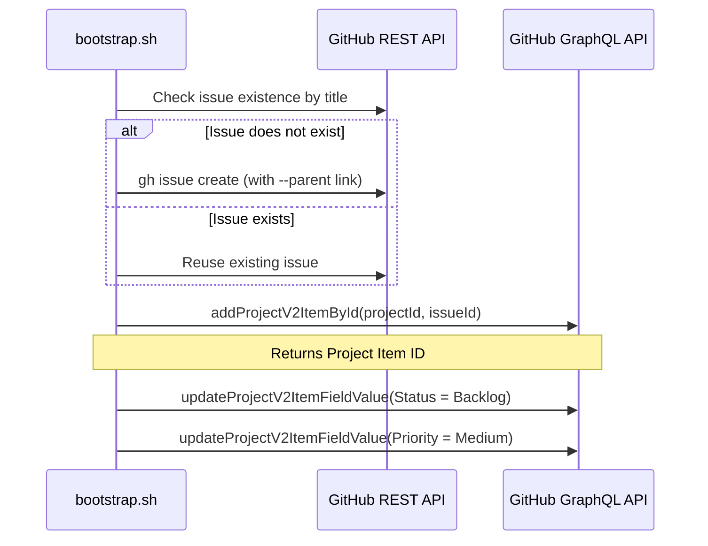

# Toolkit Architecture

This document outlines the modular design and key architectural components of the **GitHub Project Bootstrap Toolkit**.

---

## Folder Structure

```text
.github/project-bootstrap/
├── bootstrap.sh                 # Main entrypoint executable
├── create-epic.sh               # Individual Epic creator
├── create-tasks.sh              # Individual Task creator
├── lib/
│   ├── github.sh                # GitHub CLI & API communication
│   ├── issue.sh                 # Issue creation & relationships
│   ├── project.sh               # Project V2 management & fields
│   └── yaml.sh                  # Configuration parsing wrappers
├── config/
│   ├── config.yaml              # Core repository and project mapping
│   ├── labels.yaml              # Global issue label configuration
│   ├── milestones.yaml          # Product delivery milestones
│   └── roadmap.yaml             # Initial epics and backlog tasks
├── examples/
│   ├── payment-service.yaml     # Custom Epic configuration example
│   └── notification-service.yaml # Custom Epic configuration example
├── docs/
│   ├── QUICKSTART.md            # Installation and usage instructions
│   ├── ARCHITECTURE.md          # Internal mechanics & system design
│   └── TROUBLESHOOTING.md       # Handling common issues
└── README.md                    # Root overview
```

---

## Design Principles

### 1. Configuration-Driven
All system entities—including Labels, Milestones, Project V2 boards, Epics, and Tasks—are defined in declarative YAML configuration files. Adding or renaming components does not require changing bash scripts.

### 2. Modular Architecture
The shell scripts are written strictly in Bash and are separated into single-responsibility libraries:
- `lib/yaml.sh`: Converts YAML structures to JSON using `yq`, allowing robust query selectors with standard `jq`.
- `lib/github.sh`: Handles tool validation (`gh`, `jq`, `yq`), checks target repository presence, and provides wrapper methods for API calls.
- `lib/project.sh`: Manages the Project V2 lifecycle (metadata querying, project creation, single-select field config).
- `lib/issue.sh`: Manages issue creation, search, sub-issues pairing, project association, and custom field values.

### 3. Idempotency (Self-Healing)
Every component script is designed to be executable multiple times without creating duplicate resources:
- **Labels & Milestones**: Creation uses `|| true` guards or REST checks.
- **Projects**: Queries existing projects by title; it only creates a new project board if a project with the configured title does not exist.
- **Custom Fields**: Queries existing fields and options. If `Priority` or `Size` fields exist but contain incorrect options, the script deletes and recreates them. The default `Status` field options are resolved dynamically.
- **Issues**: Before creating any Epic or Task, the script searches the repository using exact title matches. If found, it retrieves the existing number and Node ID instead of creating a duplicate.

---

## GitHub Project V2 & Issue Linking Mechanics

Modern GitHub Project V2 and issue relationships (sub-issues) require GraphQL mutations. The toolkit performs the following steps during task creation:



### Sub-issues (Parent-Child relationships)
The toolkit utilizes the newly-released Sub-issues feature:
- Primary linking is achieved via the `gh issue create --parent <number>` CLI flag.
- Sourcing `lib/issue.sh` provides a fallback GraphQL mutation `addSubIssue` that uses the `"GraphQL-Features: sub_issues"` header to bind existing issues if the CLI argument fails.
